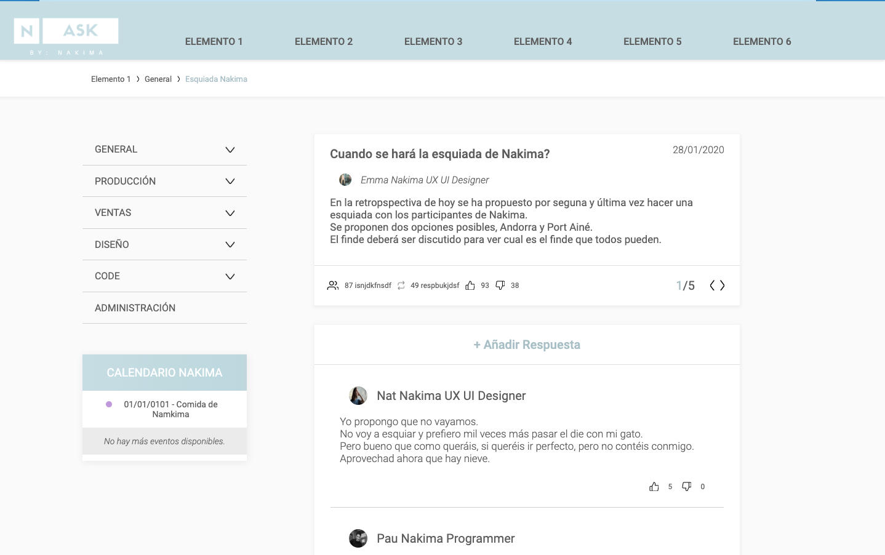

# Ellie Fairholm - N-ASK

Nakima ASK (o N-ASK) es un portal web para lanzar preguntas y recibir respuestas de
otros usuarios.



## Instalación:

Clonar este repositorio:
````
git clone https://github.com/elliefairholm/nakima-test.git
````

Instalar las dependencias:
````
npm install
````

Correr el sitio web usando webpack o en modo desarrollo o modo producción:
```
npm run start
```

Espero que os guste la página!